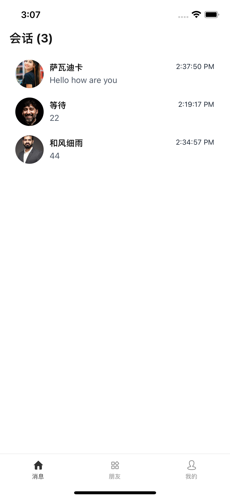
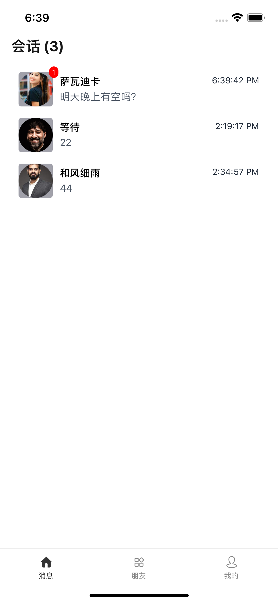
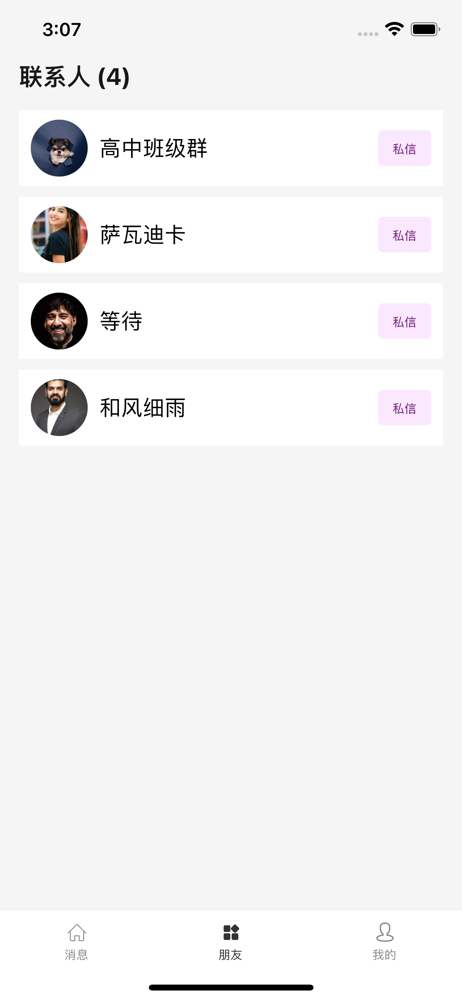
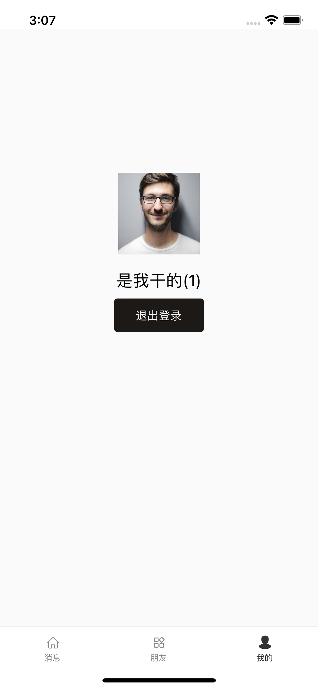
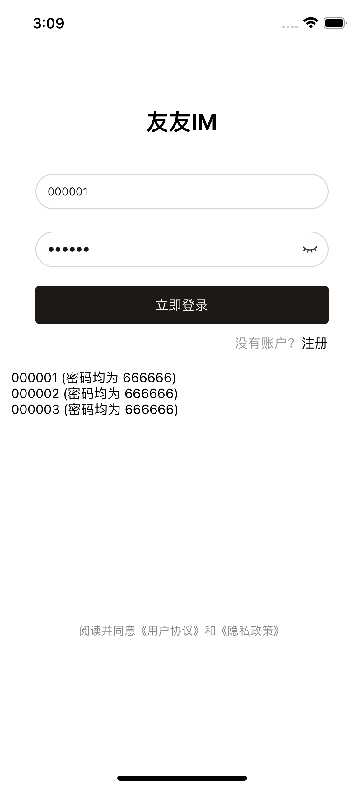

## 1. 项目介绍

React Native IM 项目

## 2. 技术选型

基于 [react-native-template](https://github.com/Webang/react-native-template)

## 3. 页面介绍

<table>
  <tr>
    <td></td>
    <td></td>
    <td></td>
  </tr>
  <tr>
    <td></td>
    <td></td>
    <td></td>
  </tr>
</table>
